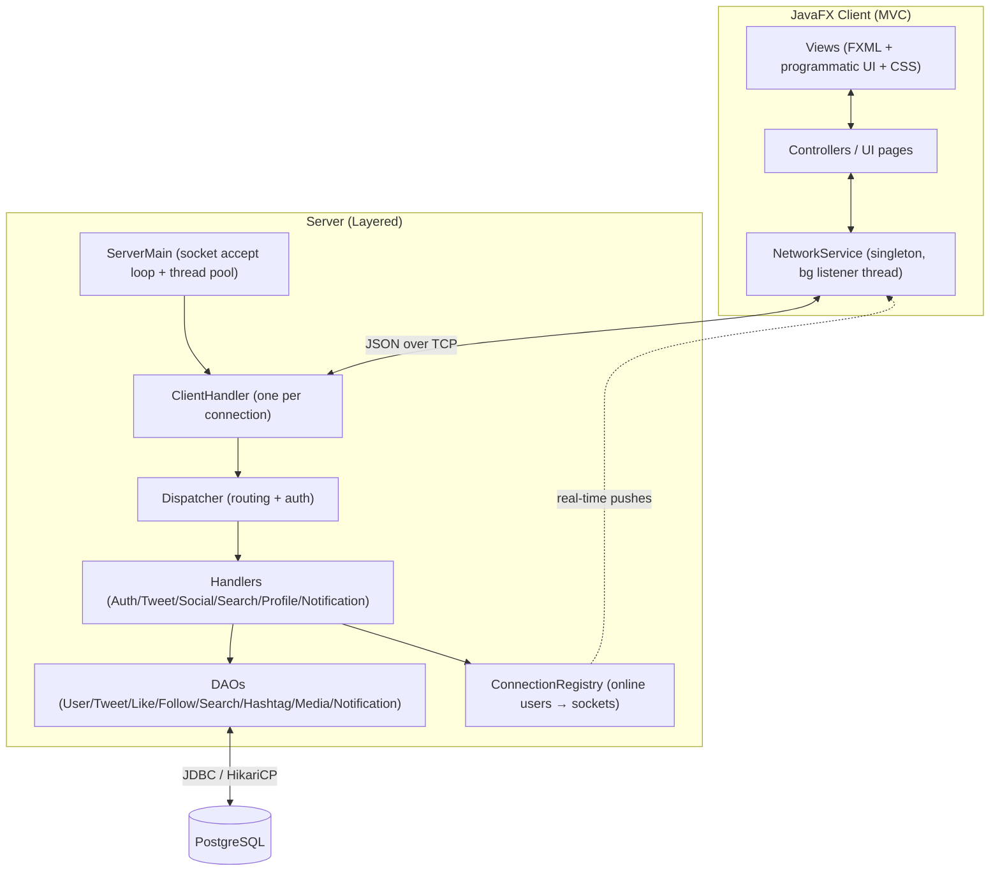
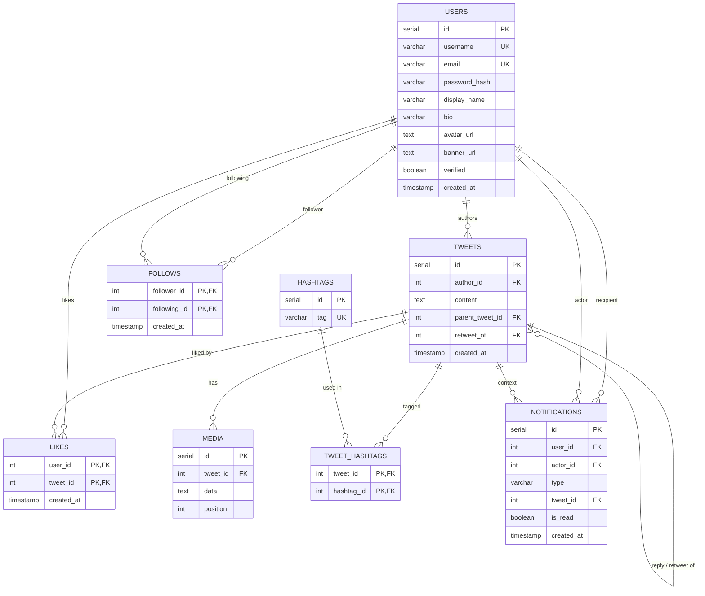
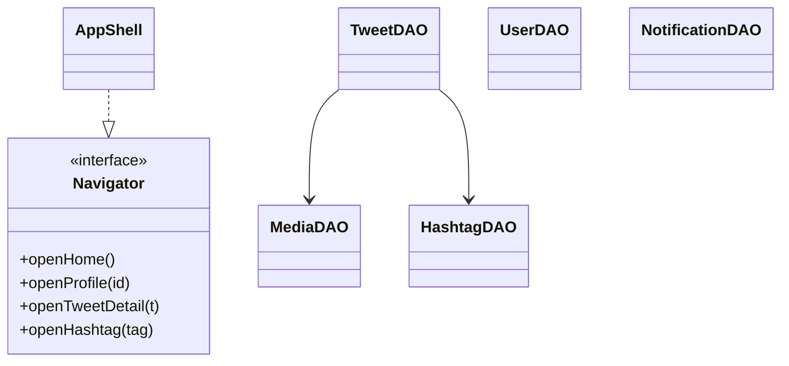

# Project Report — Twitter Clone

Advanced Programming — Summer 2026. This report describes the design,
architecture, and implementation of the Twitter/X clone, and justifies the main
technical decisions.

## Table of contents

1. [System Architecture](#1-system-architecture)
2. [Communication Protocol & Flow](#2-communication-protocol--flow)
3. [Database Design](#3-database-design)
4. [Object-Oriented Design](#4-object-oriented-design)
5. [Concurrency & Thread Safety](#5-concurrency--thread-safety)
6. [Testing & Verification](#6-testing--verification)
7. [AI Usage Disclosure](#7-ai-usage-disclosure)

---

## 1. System Architecture

The application is a **client–server** system with three Maven modules:

- **`shared`** — the contract used by both sides: the `Packet`/`PacketType`
  protocol classes, the domain models (`User`, `Tweet`, `Notification`), and the
  `HashtagParser`/`Protocol` utilities. Because both the client and server depend
  on this module, the JSON shapes can never drift apart.
- **`server`** — accepts socket connections, routes requests, runs the business
  logic, and persists everything to PostgreSQL.
- **`client`** — a JavaFX desktop application.

### Layered / MVC design

The server follows a **layered architecture**; the client follows an **MVC-like**
split (FXML/programmatic views + controllers + shared models).



### Major modules & responsibilities

| Component | Responsibility |
|-----------|----------------|
| `ServerMain` | Verifies the DB, runs `schema.sql`, opens the `ServerSocket`, and submits each connection to a fixed **thread pool**. |
| `ClientHandler` | One instance **per connected client**, runs on its own pooled thread. Reads JSON lines, delegates to the `Dispatcher`, writes responses, and unregisters on disconnect. |
| `Dispatcher` | Central **router**. Validates the session token for protected actions, then calls the correct handler with the resolved `userId`. |
| Handlers | **Business logic** only (validation, orchestration, emitting pushes). No raw SQL. |
| DAOs | **Data access** with parameterized `PreparedStatement`s. |
| `Authenticator` | Issues/validates in-memory session tokens (`ConcurrentHashMap`). |
| `ConnectionRegistry` | Maps `userId → ClientHandler` for **real-time delivery**; supports send-to-user and broadcast-to-followers. |
| `NetworkService` (client) | Single socket + background listener; correlates responses by `requestId` and dispatches pushes to typed listeners. |

---

## 2. Communication Protocol & Flow

### Message envelope

Every message is a single line of JSON (delimited by `\n`, read with
`BufferedReader.readLine()`), serialized from the shared `Packet` class:

```json
{
  "type": "CREATE_TWEET",
  "requestId": "e2b1...-uuid",
  "token": "session-uuid",
  "status": null,
  "message": null,
  "payload": { "content": "Hello #world", "media": [] }
}
```

- **`type`** — a `PacketType` value.
- **`requestId`** — a UUID generated per request; the server **echoes it** on the
  response so the client can match a response to the exact request that produced
  it (robust even with concurrent same-type requests). Server **pushes** carry no
  `requestId`.
- **`token`** — the session token; required for every action except
  `PING`/`REGISTER`/`LOGIN`.
- **`status`** — `"OK"` or `"ERROR"` on responses.
- **`payload`** — request/response body (stored internally as a `JsonElement` so
  an explicit `null` on the wire deserializes safely).

### Request/response sequence (e.g. login then tweet)

```mermaid
sequenceDiagram
    participant C as Client
    participant CH as ClientHandler (thread)
    participant D as Dispatcher
    participant H as Handler
    participant DB as PostgreSQL
    participant R as ConnectionRegistry

    C->>CH: LOGIN {username, password}
    CH->>D: dispatch
    D->>H: AuthHandler.handleLogin
    H->>DB: SELECT user; BCrypt.check
    H->>R: register(userId, handler)
    H-->>C: OK {token, userId, ...}

    C->>CH: CREATE_TWEET {content, media} (+token)
    CH->>D: dispatch (validate token → userId)
    D->>H: TweetHandler.handleCreateTweet
    H->>DB: INSERT tweet + media + hashtags (tx)
    H->>R: broadcastToFollowers(userId, NEW_TWEET_PUSH)
    R-->>C: NEW_TWEET_PUSH (to author + online followers)
    H-->>C: OK {tweet}
```

### Protocol reference (`PacketType`)

| Category | Types |
|----------|-------|
| Infra | `PING`, `PONG`, `ERROR` |
| Auth | `REGISTER`, `LOGIN`, `LOGOUT` |
| Tweets | `CREATE_TWEET`, `DELETE_TWEET`, `GET_TWEET`, `GET_USER_TWEETS`, `GET_FEED` |
| Social | `FOLLOW`, `UNFOLLOW`, `GET_FOLLOWERS`, `GET_FOLLOWING`, `LIKE_TWEET`, `UNLIKE_TWEET`, `RETWEET`, `UNDO_RETWEET` |
| Profiles | `GET_PROFILE`, `UPDATE_PROFILE` |
| Search | `SEARCH_USERS`, `SEARCH_TWEETS`, `SEARCH_HASHTAG`, `TRENDING_HASHTAGS` |
| Notifications | `GET_NOTIFICATIONS`, `MARK_NOTIFICATIONS_READ` |
| Real-time pushes | `NEW_TWEET_PUSH`, `LIKE_PUSH`, `FOLLOW_PUSH`, `NOTIFICATION_PUSH` |

---

## 3. Database Design

### Entity–Relationship Diagram



### Major entities & relationships

- **users** — accounts and profile data. Passwords are stored **only** as BCrypt
  hashes.
- **tweets** — a single table backs plain tweets, **replies** (`parent_tweet_id`
  set) and **retweets** (`retweet_of` set), which keeps the feed query uniform.
- **follows / likes** — many-to-many join tables with **composite primary keys**
  that make the relationships inherently unique/idempotent.
- **hashtags / tweet_hashtags** — normalized hashtags parsed from tweet text.
- **media** — base64 image data attached to a tweet (ordered by `position`).
- **notifications** — a recipient (`user_id`), the `actor_id` who triggered it, a
  `type`, and optional tweet context.

### DDL (from `server/src/main/resources/schema.sql`)

The schema is idempotent (`CREATE ... IF NOT EXISTS` / `ADD COLUMN IF NOT
EXISTS`) and is applied automatically on server startup by `SchemaInitializer`.
Key statements:

```sql
CREATE TABLE IF NOT EXISTS users (
    id SERIAL PRIMARY KEY,
    username VARCHAR(50) UNIQUE NOT NULL,
    email VARCHAR(255) UNIQUE NOT NULL,
    password_hash VARCHAR(255) NOT NULL,
    display_name VARCHAR(100),
    bio VARCHAR(280),
    avatar_url TEXT,
    banner_url TEXT,
    verified BOOLEAN NOT NULL DEFAULT FALSE,
    created_at TIMESTAMP DEFAULT now()
);

CREATE TABLE IF NOT EXISTS tweets (
    id SERIAL PRIMARY KEY,
    author_id INT NOT NULL REFERENCES users(id),
    content TEXT NOT NULL,
    parent_tweet_id INT REFERENCES tweets(id),
    retweet_of INT REFERENCES tweets(id) ON DELETE CASCADE,
    created_at TIMESTAMP DEFAULT now()
);
CREATE INDEX IF NOT EXISTS idx_tweets_created_at ON tweets (created_at DESC);

CREATE TABLE IF NOT EXISTS follows (
    follower_id INT NOT NULL REFERENCES users(id),
    following_id INT NOT NULL REFERENCES users(id),
    created_at TIMESTAMP DEFAULT now(),
    PRIMARY KEY (follower_id, following_id)
);

CREATE TABLE IF NOT EXISTS likes (
    user_id INT NOT NULL REFERENCES users(id),
    tweet_id INT NOT NULL REFERENCES tweets(id),
    created_at TIMESTAMP DEFAULT now(),
    PRIMARY KEY (user_id, tweet_id)
);

CREATE TABLE IF NOT EXISTS media (
    id SERIAL PRIMARY KEY,
    tweet_id INT NOT NULL REFERENCES tweets(id) ON DELETE CASCADE,
    data TEXT NOT NULL,
    position INT NOT NULL DEFAULT 0
);

CREATE TABLE IF NOT EXISTS hashtags (
    id SERIAL PRIMARY KEY,
    tag VARCHAR(140) UNIQUE NOT NULL
);
CREATE TABLE IF NOT EXISTS tweet_hashtags (
    tweet_id INT NOT NULL REFERENCES tweets(id) ON DELETE CASCADE,
    hashtag_id INT NOT NULL REFERENCES hashtags(id) ON DELETE CASCADE,
    PRIMARY KEY (tweet_id, hashtag_id)
);

CREATE TABLE IF NOT EXISTS notifications (
    id SERIAL PRIMARY KEY,
    user_id INT NOT NULL REFERENCES users(id) ON DELETE CASCADE,
    actor_id INT NOT NULL REFERENCES users(id) ON DELETE CASCADE,
    type VARCHAR(20) NOT NULL,
    tweet_id INT REFERENCES tweets(id) ON DELETE CASCADE,
    is_read BOOLEAN NOT NULL DEFAULT FALSE,
    created_at TIMESTAMP DEFAULT now()
);
```

> **Design note:** all reads that show tweets are *viewer-aware* — a single SQL
> query returns like/reply/retweet counts **and** whether the requesting user
> liked/retweeted each tweet, using correlated `EXISTS`/`COUNT` subqueries, so the
> UI never needs follow-up round trips.

---

## 4. Object-Oriented Design

### Key classes & responsibilities

| Class | Role |
|-------|------|
| `Packet` / `PacketType` | The protocol message and its type enum (shared contract). |
| `User`, `Tweet`, `Notification` | Domain models (POJOs), serialized by Gson. |
| `ClientHandler` (implements `Runnable`) | One connection, one thread. |
| `Dispatcher` | Routing + authentication. |
| `*Handler` | Business logic per feature area. |
| `*DAO` | Data access per table. |
| `NetworkService` | Client socket + async response/push handling. |
| `AppShell` (implements `Navigator`) | Main window + navigation. |
| `TweetCard`, `UserRow`, `Composer`, `FeedList` | Reusable UI components. |

### OOP principles applied

- **Encapsulation** — models expose state via getters/setters; DAOs hide all SQL;
  `Authenticator`/`ConnectionRegistry` hide their concurrent maps behind static
  methods.
- **Inheritance** — `ClientHandler implements Runnable`; `ClientMain extends
  Application`; UI components extend JavaFX nodes (`TweetCard extends VBox`,
  `UserRow extends HBox`).
- **Polymorphism** — the `Navigator` interface is implemented by `AppShell` and
  wrapped anonymously in `UserListPage`; UI pages are treated uniformly as
  `Node` providers; DAOs share mapping helpers.
- **Abstraction** — the `Binder` functional interface in `TweetDAO` abstracts the
  "bind the remaining parameters" step so one `query()` method serves every read.

### Design patterns



- **Singleton** — `DatabaseConnection` (Hikari pool), `NetworkService`,
  `UserContext`.
- **DAO** — one DAO per table isolates persistence from logic.
- **Front Controller / Router** — `Dispatcher` centralizes routing + auth.
- **Observer (push/pub-sub)** — `ConnectionRegistry` + `NetworkService` typed
  push listeners implement real-time notifications.
- **Factory methods** — `Packet.request/ok/error/push` build well-formed packets.
- **Strategy (lightweight)** — the `Binder` lambda parameterizes `TweetDAO.query`.
- **MVC** — JavaFX views/controllers over shared models.

---

## 5. Concurrency & Thread Safety

- The server serves clients with a **fixed thread pool** (`ServerMain`), one task
  (`ClientHandler`) per connection.
- Shared server state uses thread-safe structures: `Authenticator` and
  `ConnectionRegistry` use `ConcurrentHashMap`; DB access is pooled by HikariCP,
  and each DAO call uses its own connection via try-with-resources.
- `ClientHandler.sendPacket` is `synchronized`, so a request response and an
  asynchronous push can never interleave on the same socket writer.
- Writes that touch several tables (tweet + media + hashtags; deleting a tweet and
  its reply subtree) run inside **JDBC transactions** with rollback on failure.
- On the client, the background listener never touches the UI directly — every
  callback is marshalled onto the JavaFX Application Thread with
  `Platform.runLater`.

---

## 6. Testing & Verification

- **Backend** — the full request/response surface was exercised end-to-end
  against a real PostgreSQL instance with a multi-client script (two concurrent
  users): register/login, auth enforcement, tweets with hashtags, follow, like,
  reply, retweet, personalized feed (with retweet flattening and per-viewer
  flags), tweet detail, profiles/stats, search (users/tweets/hashtags), trending,
  notifications (all four types), followers list, unlike, unfollow, and cascading
  delete.
- **Client** — the whole project compiles cleanly; the JavaFX scene-graph paths
  (FXML load, CSS/theme application, tweet/user/composer components, avatar
  rendering) were smoke-tested in a headless environment.

---

## 7. AI Usage Disclosure

In the spirit of the course's academic-integrity requirement, we disclose AI
assistance used during development.

- **Tool / model used:** Anthropic **Claude** (via the Claude Code assistant).
- **Purpose:** implementing feature logic on top of the initial project scaffold,
  designing the extended JSON protocol and database schema, writing the JavaFX
  client UI, debugging, and producing documentation (this report and the README).
- **Approximate extent:** substantial. The AI assistant generated large portions
  of the server handlers/DAOs, the client UI code, the SQL schema additions, and
  the docs, working from the project specification and the pre-existing scaffold.
- **Examples of tasks where AI assisted:**
  - Designing the viewer-aware feed SQL (retweet flattening, like/retweet flags).
  - Implementing real-time push delivery (`ConnectionRegistry`, notifications).
  - Building the JavaFX components (tweet card, composer, profile, search,
    notifications) and the light/dark CSS theme.
  - Adding a `requestId` correlation field to the protocol and fixing a Gson
    null-payload deserialization edge case.
- **How output was reviewed & validated:** all generated code was compiled and
  run. The backend was verified end-to-end against a live PostgreSQL database
  with a multi-client test script, and the client was smoke-tested headlessly.
  Bugs found during verification (e.g. foreign-key handling on tweet deletion and
  the null-payload parsing issue) were corrected and re-tested before acceptance.

Work produced by team members and work assisted by AI were reviewed together; the
team understands and can explain every part of the codebase.
